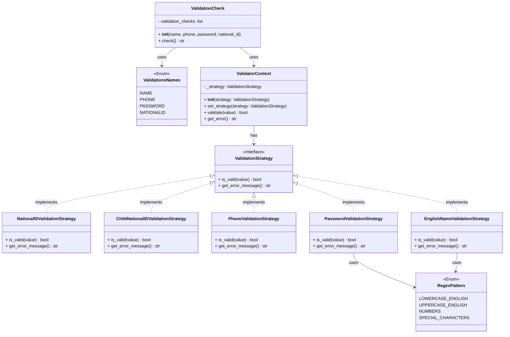

# CashBee

## Overview
CashBee is an all-in-one mobile wallet for seamless money transfers, bill payments, and donations. Its unique family feature allows the main user to create and manage limited-access sub-accounts for children, providing security and financial control.


## Scope
| Feature | Description |
|---------|-------------|
| **User Authentication** | Register / Login |
| **Transaction Management** | Set transaction limits |
| **Pay** | Send money |
| **Bill Payment** | Pay bills (Gas, Water, Electricity) |
| **Donation** | Send money to charitable organizations  |
| **Money Collection** | Collect money from others |
| **Transaction History** | View payment and collection history |
| **Family Wallet** | Manage family wallet accounts |

## Architecture
It is designed using a layered architecture to ensure scalability, security, and ease of maintenance.  
1. **Frontend (Mobile Application):** Flutter  
2. **Backend (Server Layer):** Django (Python)  
3. **Database Layer**: PostgreSQL  
4. **Authentication & Security:** Django Authentication + JWT  
5. **Notifications Service:** Firebase Cloud Messaging (FCM)  


## Process
 How the Family Wallet Application Works:
1. **User Registration & Authentication**
   - Parents/Guardians register and create a main account
   - Children get sub-accounts with parental-controlled access
   - Role-based permissions determine what each user can access


2. **Transaction Limits Configuration**
   - Parents set spending limits for each child individually
   - Establish family-wide transaction limits
   - Customize limits by transaction type (payments, donations, etc.)


3. **Financial Operations**
   - Direct Payments: Send money to contacts via QR code or phone number
   - Bill Payments: Utilities (electricity, water, gas) payment facility
   - Donations: Support approved charitable organizations
   - Money Collection: Request and receive funds from family members or contacts
    ```mermaid
    flowchart TD
    Start[Financial Operations] --> ChooseType[Choose Transaction Type]
    
    ChooseType --> Payment[Direct Payment]
    ChooseType --> BillPay[Bill Payment]
    ChooseType --> Donation[Donation]
    ChooseType --> MoneyCollect[Money Collection]
    
    Payment --> EnterDetails[Enter Payment Details]
    BillPay --> SelectBiller[Select Biller Company]
    Donation --> ChooseCharity[Choose Charity]
    MoneyCollect --> CreateRequest[Create Collection Request]
    
    EnterDetails --> ConfirmPayment[Confirm Payment]
    SelectBiller --> ConfirmBill[Confirm Bill Payment]
    ChooseCharity --> ConfirmDonation[Confirm Donation]
    CreateRequest --> SendRequest[Send Request]
    
    ConfirmPayment --> ProcessPayment[Process Transaction]
    ConfirmBill --> ProcessPayment
    ConfirmDonation --> ProcessPayment
    SendRequest --> WaitResponse[Wait for Response]
    
    ProcessPayment --> UpdateHistory[Update Transaction History]
    WaitResponse --> UpdateHistory
    
    UpdateHistory --> Notify[Send Notification]
    Notify --> ReturnHome[Return to Home]
    ```

4. **Transaction Monitoring & History**
   - All transactions are logged with detailed information
   - Filterable view by: child, date, transaction type, or amount
   - Real-time notifications for all financial activities

5. **Family Management**
   - Parents can add/remove family members
   - Customizable permissions for each family member
   - Centralized oversight of all family financial activities

# Class Diagram
1. Core Domain Models
   This section shows the fundamental business entities of the system.

2.  Enumerations & Constants
   This section defines the system's enumerations and constant values.

3. Validation System

4.  Payment System

5. Notification System

6. Database Management

7. Data Mapper

8. Role Management

